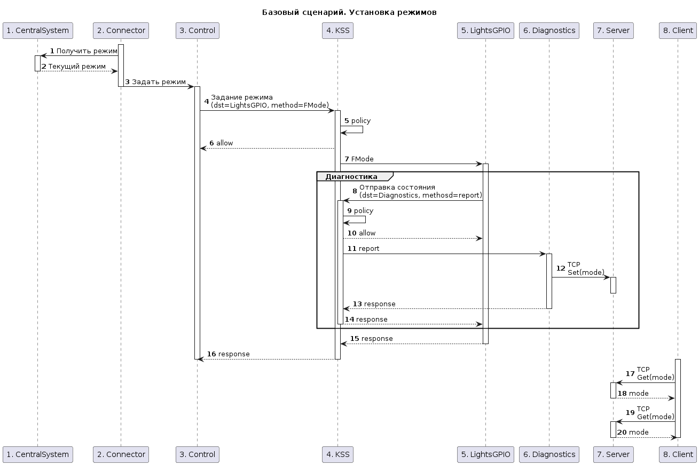
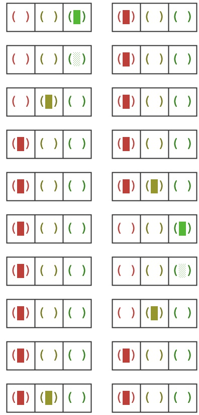

# Домашнее задание №2

- Создать ветку `day2-homework` у себя в репозитории.
- В примере «светофор» реализовать сущность `Diagnostics` по аналогии с `echo2c`. Ожидаемый результат: после запуска системы появляется сообщение от новой сущности
- Реализовать IPC взаимодействие между `LightsGPIO` и `Diagnostics`. Передать сообщение при помощи arena.
Ожидаемый результат: тестовое сообщение от `LightsGPIO` получено в `Diagnostics` Примечание: для этого задания может быть полезным посмотреть код примера из SDK `secure_logger`
- Реализовать вывод состояния по TCP/IP сети (при подключении на порт 7777 выдавать информацию о состоянии в котором светофор в данный момент).
- Реализовать вывод аудита только для взаимодействий между `LightsGPIO` и `Diagnostics`

# Решение

## Diagnostics

[Реализована](https://github.com/russkin/cyberimmune-systems-example-traffic-light-kos/commit/953a48ad44320755f88acf2d18e74369382930ee) сущность `Diagnostics`, получающая сообщения только от `LightsGPIO`, описана соответствующая политика безопасности.

[Базовый сценарий](https://www.plantuml.com/plantuml/uml/hL9DYnGn4BtdLnHpMa4R_D13myZ2Yekek30Uzz9EmcmmdJH9zOWtruCN3uiWUFFY7sZKqLbnzIzK_oChwHrxCuXuy910gbvUNhsNtO2LnxOs0ZKQ1HDwGnrzfH_qiNzDfz0VzwzeHMVKzIzeJQS5q0UklMJGMGJHD-g0MolwmktliJGHechHsRP-ehnec5xFTLDPXCdL0lQSHU_C1Ae0SpHv_re1zsUpr7iQGjwxNi03lJZ2i7zmxr62Q9SZRXHmHrSBwmBNGe98FkUWcmNCb5ygd_h1B_FsBLPejB8u23GMUPevwcM5Akdb1LTkHtabq3ksuNEoOashYpPqXtP71foEYYz3hV38oUdTXqwgIoDf79JNRzB66Jr_FfIunk-LK1dZdcrGsfMGI4OETa8il6iReBUqPa6VOZefftLCI6WtYdxFrP-ijTkaTpn0UJ-9a_Gdv-8lc7ckFiYfLutp-E_wjSlbfqXA66X6bXHKt1WIKodXyTx1ePqftAbpls9aKkN7T6yZmAlGE1iKepBwJ58E6YTHLa9oKh1dV-VKBWjfn6npIfNzeF533VyhRldK-t-UcbTyBTqg8GAsZFYVL5BbAeNOPM_Qslm2)

## Server

Компонент `Diagnostics` отправляет текущее состояние светофора в компонент `Server`. `Server` в свою очередь по запросу (записать в сокет значение `0xFFFFFFFF` и прочитать текущее значение) отдает сохраненное состояние и завершает TCP соединение.
Для того, чтобы решение заработало, необходимо было добавить компоненты `kl.VfsNet` и (что не очевидно) `kl.drivers.BSP` вместе с `kl.drivers.GPIO`.

[diff](https://github.com/cyberimmunity-edu/cyberimmune-systems-example-traffic-light-kos/commit/e8527b3618491197d3a11a12485090aae40e7932)

## Audit

[Добавлен](https://github.com/cyberimmunity-edu/cyberimmune-systems-example-traffic-light-kos/commit/ccffdf10122a8ca1ef4d87ea0c369913c5a922da) объект политики на основе политики `Base`. Заменены правила взаимодействия между компонентами `LightsGPIO` и `Diagnostics` на новые для отображения для получения записей аудита. Чтобы все заработало дополнительно нужно было включить в решение `KlogEntity` и `KlogStorageEntity` и соотвествтующие им политики безопасности.

## Client*

Для отображения текущего состояния светофоров добавлен в решение добавлен TCP клиент, запрашивающий и визуализирующий состояние светофоров в псевдо-графике.

## ControlSystem*

Для отображения правдоподобного переключения светофоров измененен компонент `ControlSystem`:
- В соответствии со схемой добавлен порядок переключения светофоров и время задержки между переключениями

- Изменена политика безопасности для отображения только разрешенных состояний, что позволило [сократить](https://github.com/cyberimmunity-edu/cyberimmune-systems-example-traffic-light-kos/commit/e8527b3618491197d3a11a12485090aae40e7932#diff-41112937b5ae7776f78363b3e9c58f254fd6b632a1d74e787b427a7f5f78ddaa) размер политики безопасности по отношению к предыдущему варианту.